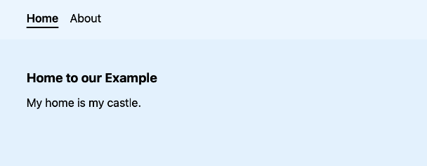

# Example for responsive mobile menu using react, remix and tailwind

This example uses [react](reactjs.org), [remix](remix.run) and [tailwind](tailwindcss.com)
to create a menu that changes responsively when going from a large screen to a 
small mobile phone screen (with a burger menu).

* Menu Wide
  
* Menu Small Closed
  
* Menu Small Open
  


## Development

From your terminal:

```sh
npm run dev
```

This starts your app in development mode, rebuilding assets on file changes.

## Deployment

First, build your app for production:

```sh
npm run build
```

Then run the app in production mode:

```sh
npm start
```

Now you'll need to pick a host to deploy it to.

